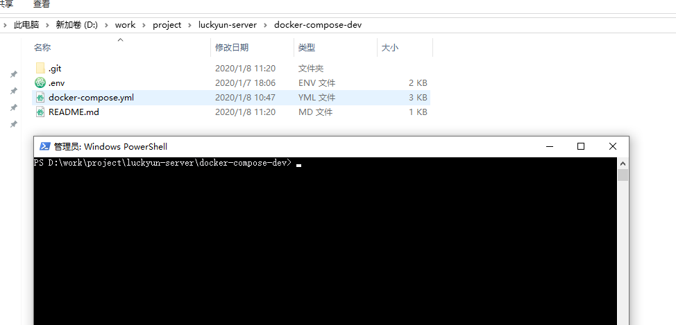
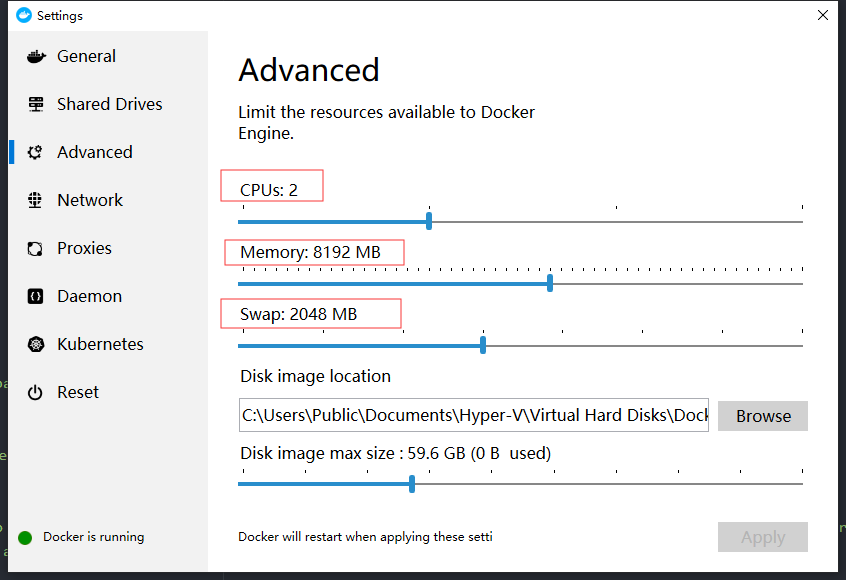
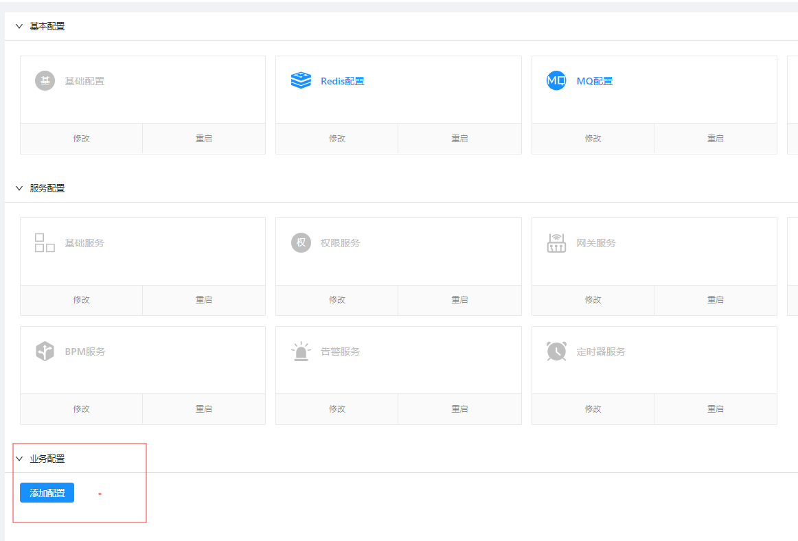
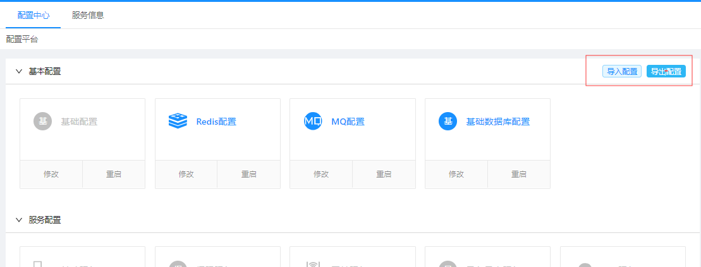

## 功能介绍

目前与业务开发相关的基础服务已有数十个之多，为了简化开发中各服务的启动工作，本工具将开发环境中需要的各服务集成进`docker-compose`，只要运行一条命令，就能将开发中依赖的各服务启动，并且拥有独立的`redis`和`RabbitMQ`服务，规避团队开发时的数据冲突以及消息被他人消费等问题。

## 服务列表

```
- mq
- redis
- eureka
- config
- gateway
- auth
- base
- bpm-api
- oss
- report
```

## 使用

由于集成环境并未集成数据库（因为数据库本身是需要团队共享联调的），所以在初次启动各服务之前，需要先配置`Base服务`和`BPM服务`的数据源：

编辑根目下的`.env`文件

```
# 基础数据库
BASE_DRIVER=com.mysql.cj.jdbc.Driver
BASE_URL=jdbc:mysql://10.10.10.81:3306/luckyun?useUnicode=true&characterEncoding=utf-8&serverTimezone=CTT
BASE_USERNAME=root
BASE_PASSWORD=luckserver

# 工作流库
BPM_DRIVER=com.mysql.cj.jdbc.Driver
BPM_URL=jdbc:mysql://10.10.10.81:3306/activiti6?useUnicode=true&characterEncoding=utf-8&serverTimezone=CTT&useSSL=false
BPM_USERNAME=root
BPM_PASSWORD=luckserver
```

将上面的配置换成本身项目的配置。


接下来，在本机`HOST`文件中加入如下配置：

```
127.0.0.1 host.docker.internal
```
host文件地址
- Windows：C:\Windows\System32\drivers\etc
- Mac：/etc/hosts
- linux：/etc/hosts

在下载好的本项目根目录打开`命令行`：



执行如下命令初始化并启动各服务:

```
docker-compose up
```

也可以选择必要的服务启动

```
docker-compose up redis mq eureka config gateway auth base
```

启动的服务越多消耗的本机资源越多，如果`Docker`分配的内存不足，`eureka`服务可能会出现如下错误：

```
 c.n.e.cluster.ReplicationTaskProcessor   : It seems to be a socket read timeout exception, it will retry later. if it continues to happen and some eureka node occupied all the cpu time, you should set property 'eureka.server.peer-node-read-timeout-ms' to a bigger value
```

解决方式是在`Docker`设置里调大分配的资源：



服务启动成功后

`eureka服务`访问地址：
```
http://localhost:20000/
```

`config服务`访问地址：

```
http://localhost:8181
```

默认账号:`admin`，密码：`luckserver`

如需要添加业务服务配置，在配置界面点击`添加配置`



本机的配置的环境可以`导出`，用于`测试`、`生产`等环境的模板



## 镜像版本

在`.env`文件中可以设置各基础服务的版本和私有云地址

```
# 镜像配置
REGISTER_URL=10.10.10.52:5000
MQ_IMAGE=rabbitmq:3-management
REDIS_IMAGE=redis:5.0.7

EUREKA_IMAGE=com-luckyun-eureka:1.1.3-RELEASE
CONFIG_IMAGE=com-luckyun-config:1.1.6-RELEASE
GATEWAY_IMAGE=com-luckyun-gateway-admin:1.1.1-RELEASE
AUTH_IMAGE=com-luckyun-auth-admin:1.1.3-RELEASE
BASE_IMAGE=com-luckyun-base-admin:1.1.4-RELEASE
BPM_API_IMAGE=com-luckyun-bpm-api:1.1.2-RELEASE
OSS_IMAGE=com-luckyun-oss-pro-admin:1.1.2-RELEASE
REPORT_IMAGE=com-luckyun-report-admin:1.1.1-RELEASE
```
## 在线模式

如果想直接使用线上的服务进行开发，可以取消下面的注释，并且配成相应的地址：

```
# 远程服务地址（需要加上http）
LUCKYUN_BASE=http://10.10.10.52:14665
LUCKYUN_AUTH=http://10.10.10.52:5192
LUCKYUN_OSS_PRO=http://10.10.10.52:29148
LUCKYUN_REPORT=http://10.10.10.52:21892
```

> 注：远程服务需要映射对应的端口

这样我们本机只要起必要的服务即可

```
docker-compose redis mq eureka config gateway
```


## 常用命令

初始化并启动各服务:

```
docker-compose up [service_name…]
```

当`docker-compose`文件发生变化时，也需要执行该命令更新服务。

启动各服务:

```
docker-compose start [service_name…]
```

停止各服务:

```
docker-compose stop [service_name…]
```

重启各服务:

```
docker-compose restart [service_name…]
```

卸载各服务:

```
docker-compose down 
```

> 注：卸载所有服务会导致各服务数据丢失 


列出项目中目前的所有容器:

```
docker-compose ps
```

查看容器的日志输出:

```
docker-compose logs [service_name…]
```

查看正在运行的容器:

```
docker exec -it  containerID  /bin/bash
```